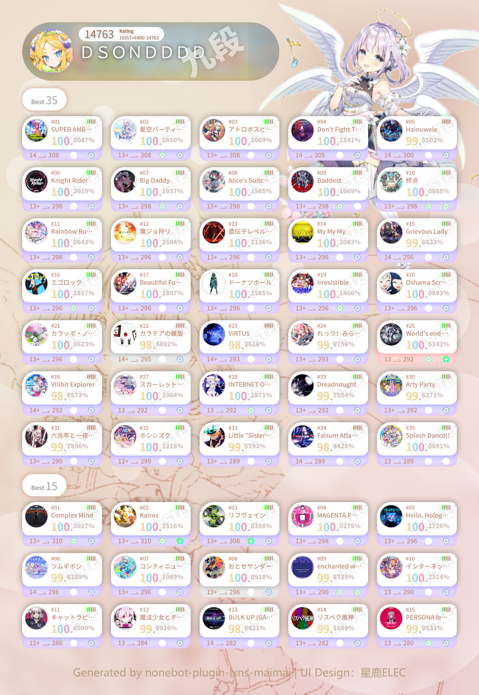

<!-- markdownlint-disable MD033 MD036 MD041 MD045 -->
<div align="center">
  <a href="https://v2.nonebot.dev/store">
    
  </a>
</div>

<div align="center">

# NoneBot-Plugin-MaiMai

_✨ NoneBot maimai DX 查分插件 ✨_

<a href="">
  
</a>

<a href="https://pdm.fming.dev">
  
</a>
<a href="https://github.com/nonebot/plugin-alconna">
  
</a>

<br/>

<a href="https://registry.nonebot.dev/plugin/nonebot-plugin-lxns-maimai:nonebot_plugin_lxns_maimai">
  
</a>
<a href="https://registry.nonebot.dev/plugin/nonebot-plugin-lxns-maimai:nonebot_plugin_lxns_maimai">
  
</a>

<br />

<a href="#-效果图">
  <strong>📸 演示与预览</strong>
</a>
&nbsp;&nbsp;|&nbsp;&nbsp;
<a href="https://github.com/KomoriDev/nonebot-plugin-lxns-maimai/wiki/%E5%AE%89%E8%A3%85">
  <strong>📦️ 下载插件</strong>
</a>
&nbsp;&nbsp;|&nbsp;&nbsp;
<a href="https://qm.qq.com/q/Vuipof2zug" target="__blank">
  <strong>💬 加入交流群</strong>
</a>

</div>

## 📖 介绍

NoneBot maimai DX 查询插件。

## 🎉 配置 & 使用

详见 Wiki：[📖 这里](https://github.com/KomoriDev/nonebot-plugin-lxns-maimai/wiki)

## 📸 效果图



## 💖 鸣谢

- [@Lxns-Network](https://github.com/Lxns-Network)：提供了超棒的 maimai DX 查分器
- [@星鹿ELEC](https://space.bilibili.com/628990513)：绘制了好康的 Best 50 查分图

## 📄 许可证

本项目使用 [MIT](./LICENSE) 许可证开源

```text
THE SOFTWARE IS PROVIDED "AS IS", WITHOUT WARRANTY OF ANY KIND, EXPRESS OR
IMPLIED, INCLUDING BUT NOT LIMITED TO THE WARRANTIES OF MERCHANTABILITY,
FITNESS FOR A PARTICULAR PURPOSE AND NONINFRINGEMENT. IN NO EVENT SHALL THE
AUTHORS OR COPYRIGHT HOLDERS BE LIABLE FOR ANY CLAIM, DAMAGES OR OTHER
LIABILITY, WHETHER IN AN ACTION OF CONTRACT, TORT OR OTHERWISE, ARISING FROM,
OUT OF OR IN CONNECTION WITH THE SOFTWARE OR THE USE OR OTHER DEALINGS IN THE
SOFTWARE.
```
